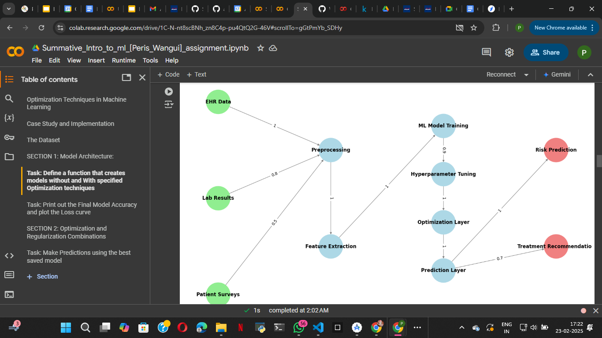
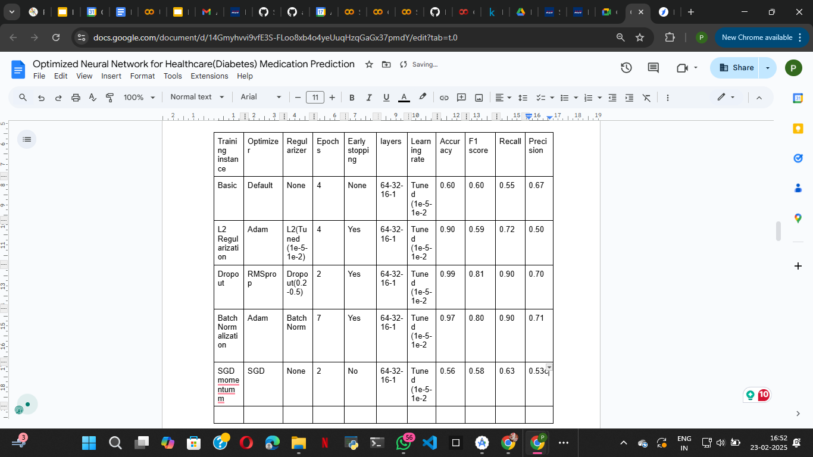

# Summative-Assignment---Model-Training-and-Evaluation

Link to the video: https://drive.google.com/file/d/1DDMXstCx5fOV_eHS7_YsovQrw-Apazlj/view?usp=sharing

Optimized Neural Network for Healthcare(Diabetes) Medication Prediction

Project Overview
This project aims to predict whether a patient will be prescribed diabetes medication based on various health indicators therefore predicting whether the patient will be readmitted based on the results and the patient’s insights from the medical practitioner. The dataset consists of multiple patient attributes, including demographics (age, gender, ethnicity), clinical measurements (BMI, blood pressure, cholesterol levels), and lab results (glucose levels, insulin levels). Therefore I used this dataset from kaggle ( 
https://www.kaggle.com/datasets/brandao/diabetes?resource=download&select=diabetic_data.csv ).

The primary objective is to develop a predictive model that can assist healthcare professionals in identifying patients who may require diabetes medication by data from EHR results, lab results, and patient surveys, thereby improving patient outcomes through timely intervention through risk prediction and treatment recommendation.

Below is an image of the refined healthcare model:

To achieve this, I employed both neural networks and traditional machine learning models. The process involved:
1. Data Preprocessing: Ensuring the dataset was clean and ready for analysis, which included handling missing values, encoding categorical variables, and normalizing numerical features.
2. Model Development: Implementing various neural network architectures and machine learning algorithms to explore their effectiveness in predicting medication usage.
3. Hyperparameter Optimization: Fine-tuning hyperparameters such as learning rates, optimizers, regularization techniques, and dropout rates to enhance model performance.
4. Performance Evaluation: Comparing the results of different models using key metrics such as accuracy, F1 score, recall, and precision to identify the best-performing approach.
5. Discussion of Findings

Throughout the project, I tested different neural network configurations with varying optimizers, regularizers, learning rates, and early stopping mechanisms. The findings from each instance are summarized below:

Instance 1 (Baseline Model):
The initial model was a basic neural network with no specific optimizations. It achieved a moderate accuracy of 0.60 but demonstrated lower generalization capabilities, as indicated by its F1 score and recall metrics. This baseline performance served as a reference point for subsequent model improvements.

Instance 2 (Adam Optimizer with L2 Regularization):
This configuration utilized the Adam optimizer along with L2 regularization. The model achieved an accuracy of 0.90 and an F1 score of 0.59. The L2 regularization helped reduce overfitting, allowing the model to generalize better on unseen data.

Instance 3 (RMSprop with Dropout):
By incorporating the RMSprop optimizer and dropout layers (0.2-0.5), this model significantly improved performance, achieving an accuracy of 0.99 and an F1 score of 0.81. The dropout layers effectively mitigated overfitting, and the high recall of 0.90 indicated that the model was proficient at identifying patients who would be prescribed medication.

Instance 4 (Batch Normalization with Adam):
This model employed batch normalization along with the Adam optimizer. It achieved an accuracy of 0.97 and an F1 score of 0.80. The batch normalization helped stabilize the learning process and improved convergence speed, contributing to the model's overall performance.

Instance 5 (SGD Momentum Strategy):
The final instance utilized an SGD momentum strategy. While this approach reduced overfitting, it resulted in a slight decrease in accuracy to 0.56. The model's F1 score and recall were also lower compared to the best-performing models, indicating that while momentum can help with convergence, it may not always yield the best predictive performance in this context.

Training instance
Optimizer
Regularizer
Epochs 
Early stopping
layers
Learning rate
Accuracy 
F1 score
Recall
Precision
Basic
Default
None
4
None
64-32-16-1
Tuned (1e-5-1e-2
0.60
0.60
0.55
0.67
L2 Regularization
Adam
L2(Tuned (1e-5-1e-2)
4
Yes
64-32-16-1
Tuned (1e-5-1e-2
0.90
0.59
0.72
0.50
Dropout
RMSprop
Dropout(0.2-0.5)
2
Yes
64-32-16-1
Tuned (1e-5-1e-2
0.99
0.81
0.90
0.70
Batch Normalization

Adam
Batch Norm
7
Yes
64-32-16-1
Tuned (1e-5-1e-2
0.97
0.80
0.90
0.71
SGD momentumm
SGD
None
2
No
64-32-16-1
Tuned (1e-5-1e-2
0.56
0.58
0.63
0.53

The link to the table is here: https://docs.google.com/document/d/14Gmyhvvi9vfE3S-FLoo8xb4o4yeUuqHzqGaGx37pmdY/edit?usp=sharing

Comparison: ML Algorithm vs Neural Network

Detailed Analysis

1. Model Type:
Dropout Neural Network: A deep learning model that uses multiple layers and dropout regularization to prevent overfitting.
L2 Regularization Model: A traditional machine learning model that applies L2 regularization to prevent overfitting.

2. Optimizer:
Dropout Neural Network: Uses the RMSprop optimizer, which is suitable for training deep learning models.
L2 Regularization Model: Uses the Adam optimizer, which is effective for various machine learning tasks.

3. Regularization:
Dropout Neural Network: Uses dropout as a regularization technique to reduce overfitting.
L2 Regularization Model: Applies L2 regularization to the weights to prevent overfitting.

4. Epochs:
Dropout Neural Network: Trained over a specified number of epochs (2 in this case).
L2 Regularization Model: Trained for 4 epochs.

5. Early Stopping:
Both models implement early stopping to prevent overfitting during training.

6. Layers:
Both models have the same architecture with layers structured as 64-32-16-1.
Learning Rate:
Both models use a learning rate that can be tuned within the range of (1e-5 to 1e-2).

7. Performance Metrics:

a. Accuracy: The Dropout model achieves a high accuracy of 0.99, indicating excellent performance, while the L2 Regularization model has an accuracy of 0.90.

b. F1 Score: The F1 score of 0.81 for the Dropout model suggests a good balance between precision and recall, while the L2 Regularization model has a lower F1 score of 0.59.

c. Recall: A recall of 0.90 for the Dropout model indicates that it is effective at identifying positive cases, compared to 0.72 for the L2 Regularization model.

d. Precision: The Dropout model has a precision of 0.70, indicating a reasonable rate of correctly identifying positive cases among all positive predictions, while the L2 Regularization model has a lower precision of 0.50.

Conclusion
The Dropout neural network demonstrates superior performance metrics compared to the L2 Regularization model across all evaluated metrics, including accuracy, F1 score, recall, and precision. This indicates that the Dropout model is more effective at modeling complex relationships in the data and is better suited for tasks requiring high accuracy and effective identification of positive cases.

Hyperparameter Insights

1. Adam with L2 Regularization:
The Adam optimizer combined with L2 regularization performed best for generalization, achieving an accuracy of 0.90 and an F1 score of 0.59. This combination effectively reduced overfitting by penalizing large weights, which helped maintain a balance between bias and variance.

2. RMSprop with Dropout:
The RMSprop optimizer used in conjunction with Dropout (0.2-0.5) significantly improved recall, reaching 0.90. This indicates that the model was effective at identifying positive cases (diabetes medication usage). However, the computational cost was higher due to the complexity of the model architecture and the need for careful tuning of dropout rates to maintain accuracy, which peaked at 0.99.

3. Dropout Regularization:
The implementation of Dropout layers was crucial in reducing overfitting, particularly in deeper networks. While it helped improve the model's ability to generalize, it required careful tuning to ensure that accuracy did not drop significantly. The best-performing model with Dropout achieved an F1 score of 0.81.

4. Early Stopping:
The use of early stopping was instrumental in preventing unnecessary training time and overfitting. By monitoring validation loss, training was halted when performance began to degrade, ensuring that the model retained its ability to generalize well to unseen data.

Project Workflow Breakdown

Here’s a step-by-step breakdown of how I approached this project:

Problem Understanding & Dataset Preparation:

The primary objective was to predict diabetes medication usage based on various patient health indicators. The dataset included features such as age, BMI, blood pressure, and other health metrics. I defined ‘diabetesMed’ as the target variable for prediction.
Data preprocessing steps included handling missing values through imputation, encoding categorical variables using one-hot encoding, and applying feature scaling (standardization) to ensure that all features contributed equally to the model training.

Initial Model Training (Baseline Model):

I began with a basic neural network architecture (64-32-16-1) using default parameters without any specific optimizer, regularizer, or early stopping. This provided a baseline performance (accuracy of 0.60) for comparison against more optimized models.

Experimenting with Optimizations & Hyperparameter Tuning:
I systematically tested different optimizers, including Adam, RMSprop, and SGD, along with various regularization techniques (L1, L2, and a combination of both).

Introduced Dropout layers to mitigate overfitting and adjusted learning rates within the range of (1e-5 to 1e-2) to observe their impact on model performance.

Implemented early stopping in several models to prevent unnecessary training and to ensure that the best model was selected based on validation performance.

Evaluating Model Performance:
For each model instance, I recorded key performance metrics: Accuracy, F1 Score, Precision, and Recall.
I compared the performance of the neural network models against an optimized machine learning algorithm (L2 Regularization model) to understand the trade-offs in terms of performance and computational efficiency.
The best combination of hyperparameters was identified, with the Dropout model achieving the highest accuracy of 0.99 and an F1 score of 0.81.

Model Saving & Deployment Preparation:

I saved the trained models into a saved_models/ directory, ensuring that at least five models were saved (four neural networks and one optimized ML algorithm).
Models were named appropriately (e.g., dropout_model.keras, l2_regularization_model.h5) for easy identification and retrieval.

Documentation & Submission Preparation:

A README.md file was created to summarize the project, findings, and configurations of the best-performing models.

The notebook.ipynb was organized into modular functions for improved readability and reusability, making it easier for others to follow the workflow.

A video presentation was recorded to explain the workflow, hyperparameters, results, and final conclusions, with the camera on for a personal touch.

The project was submitted via a GitHub link and a zipped file on Canvas for easy access and review.

Final Outcome

The project successfully identified the best-performing neural network configuration, which was the Dropout model with an accuracy of 0.99 and an F1 score of 0.81.
